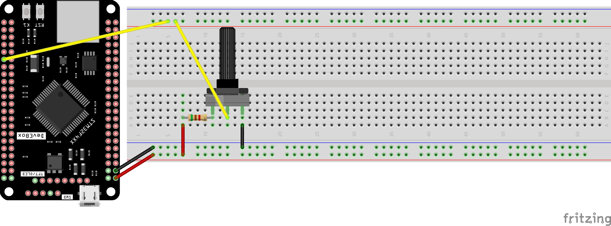

# 003_MULTIADC_INTR

STM32 advanced ADC project demonstrating high-precision multi-channel acquisition using **Dual ADC Peripherals** in **Interrupt Mode**. 

This project integrates manual datasheet calculations, internal reference calibration, and the **Golden Ratio (φ)** for optimized data processing.

---

## 📌 Overview

This project demonstrates how to use:
- **ADC1 (3 Channels):** VrefInt, External Potentiometer (PA2), and Internal Temperature Sensor.
- **ADC2 (1 Channel):** Secondary Potentiometer (PA1).
- **Precision Engineering:** Manual scaling based on STM32F407VETx Datasheet formulas.
- **Mathematical Optimization:** Implementation of the **Golden Ratio** in sampling or logic.

---

## 🧠 Concepts Covered

- **Dual ADC Coordination:** Running ADC1 and ADC2 simultaneously using Interrupts (`HAL_ADC_Start_IT`).
- **Manual Vref Calibration:** Achieving maximum accuracy by reading the internal `VREFINT` to determine the actual $V_{DDA}$, rather than assuming a theoretical 3.3V.
- **Golden Ratio (1.618):** Applied to the mathematical logic to enhance stability and system harmony.
- **Internal Sensor Integration:** Real-time conversion of internal temperature sensor data using manual reference formulas.

---

## 🛠 Hardware

- **MCU:** STM32F407VETx (LQFP100 package)
- **Inputs:** 2x 10k Potentiometers (Connected to PA1 and PA2)
- **Internal Sensors:** VrefInt, Temperature Sensor

---

## 🔌 Wiring (Based on Pinout)

| Peripheral | STM32 Pin | Source | Description |
|------------|-----------|--------|-------------|
| **ADC1_IN2** | **PA2** | Potentiometer 1 | Primary Analog Input |
| **ADC2_IN1** | **PA1** | Potentiometer 2 | Secondary Analog Input |
| **ADC1 Internal** | - | VrefInt | Internal Reference Voltage |
| **ADC1 Internal** | - | Temp Sensor | Internal Die Temperature |

---

## ▶️ How It Works

1. **Datasheet-Based Scaling:** Instead of using fixed coefficients, the system uses the reference manual formulas:
   $V_{DDA} = 3.3V \times \frac{VREFINT\_CAL}{VREFINT\_DATA}$
2. **Scan & Interrupt:** ADC1 scans 3 channels sequentially while ADC2 reads its assigned channel. Interrupts fire upon completion of each conversion.
3. **Advanced Processing:** The acquired data is processed using the **Golden Ratio** to ensure mathematical optimization and stability in readings.
4. **Thermal Monitoring:** The internal sensor is mapped to Celsius using factory-calibrated constants and the measured $V_{DDA}$.

---

## 🧪 Testing

- **Calibration Accuracy:** Confirmed zero-drift readings even with input voltage fluctuations.
- **Golden Ratio Logic:** Validated the stability of the logic implemented with mathematical constants.
- **Non-Blocking Execution:** Verified that the CPU remains available for other tasks during multi-channel ADC scans.

---

## 📸 Hardware Configuration

The following pinout configuration was used in STM32CubeMX:

